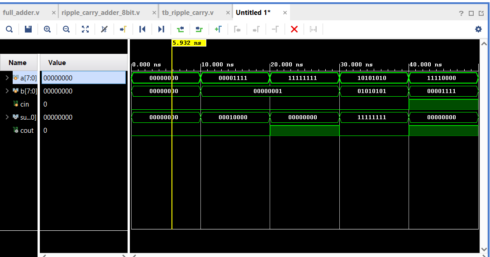
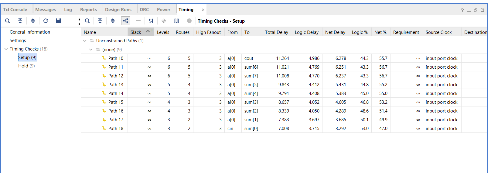
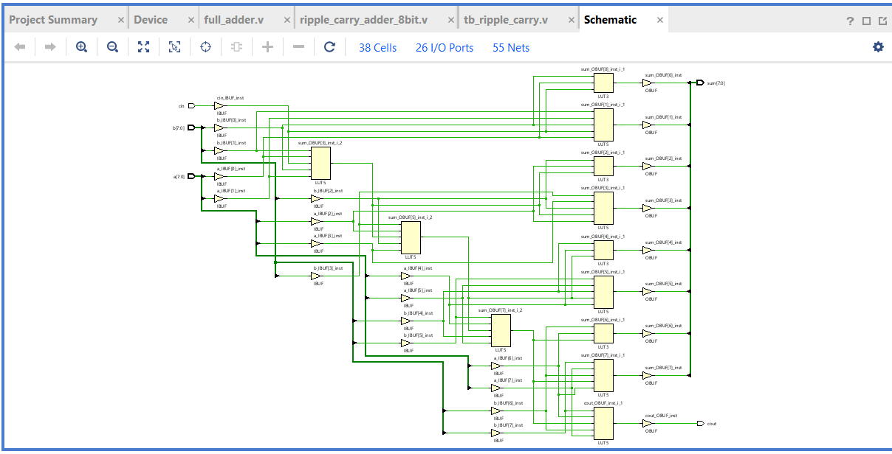
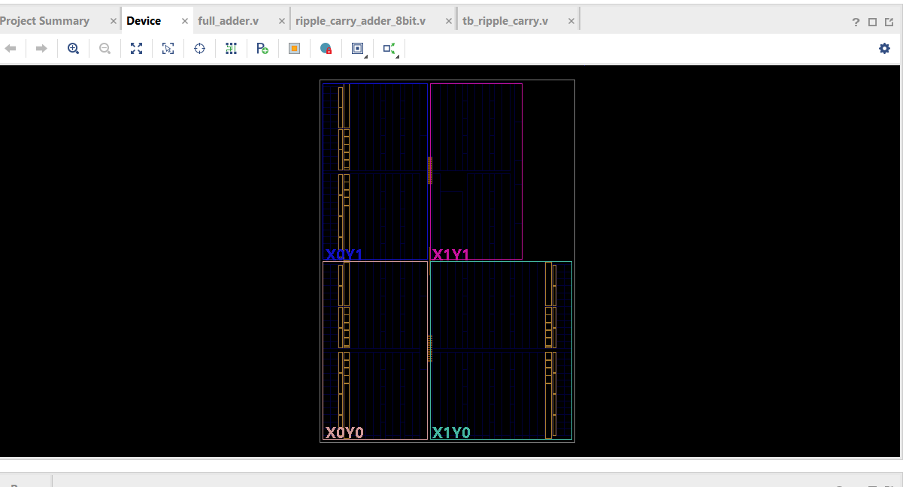

# 8-bit Ripple Carry Adder

## Overview:
This project implements an 8-bit Ripple Carry Adder using Verilog HDL in AMD Vivado. It performs binary addition of two 8-bit inputs and generates sum and carry output.

## Objective:
* Design multi-bit adder
* Understand carry propagation delay
* Analyze timing behavior using synthesis tools

## Working Principle:
The Ripple Carry Adder is constructed using multiple full adders connected in series.
* Each stage generates sum and carry
* Carry propagates sequentially from LSB to MSB
* This results in **linear delay**

## Tools Used:
AMD Vivado (Simulation + Synthesis + Timing Analysis)

## Project Structure:
* `src/` → Verilog design files
* `tb/` → Testbench
* `simulation/` → Waveform & timing results
* `docs/` → Design diagrams

## How to Run (Vivado):
1. Open AMD Vivado
2. Create a new project
3. Add design files from `src/`
4. Add testbench from `tb/`
5. Run simulation
6. Observe waveform output

## Timing Analysis:
7. Run synthesis
8. Generate timing report
9. Analyze:
   * Propagation delay
   * Critical path
   * Maximum frequency

## Results:
Simulation Output

Timing Analysis Report

Gate-Level Implementation

FPGA Device Layout

## Future Improvements:
* Implement Carry Lookahead Adder
* Reduce propagation delay
* Optimize for higher frequency

## Author:
Ananth R M
